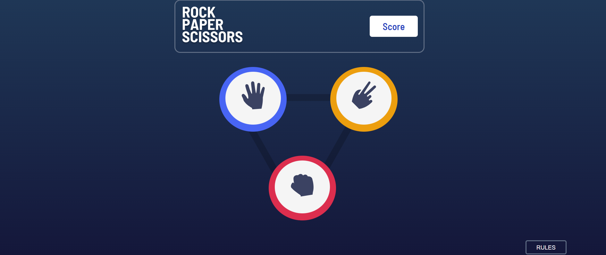
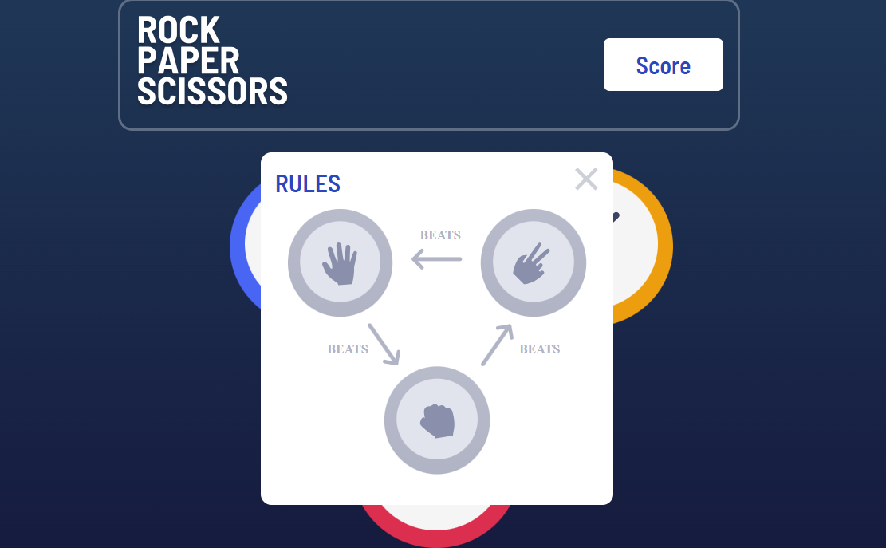
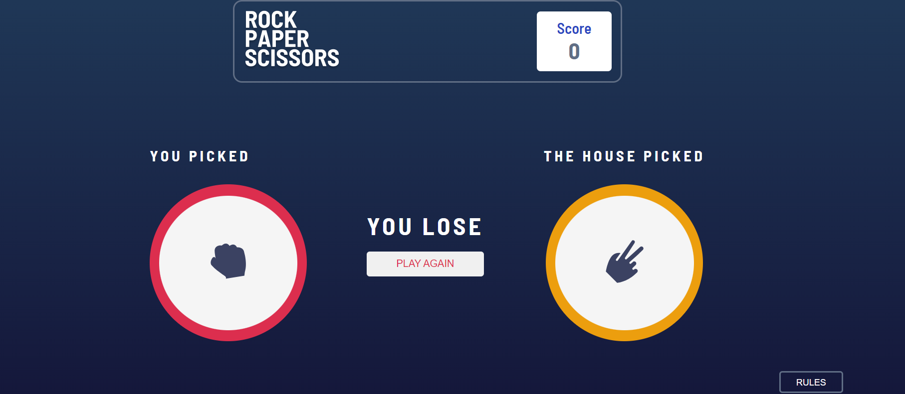
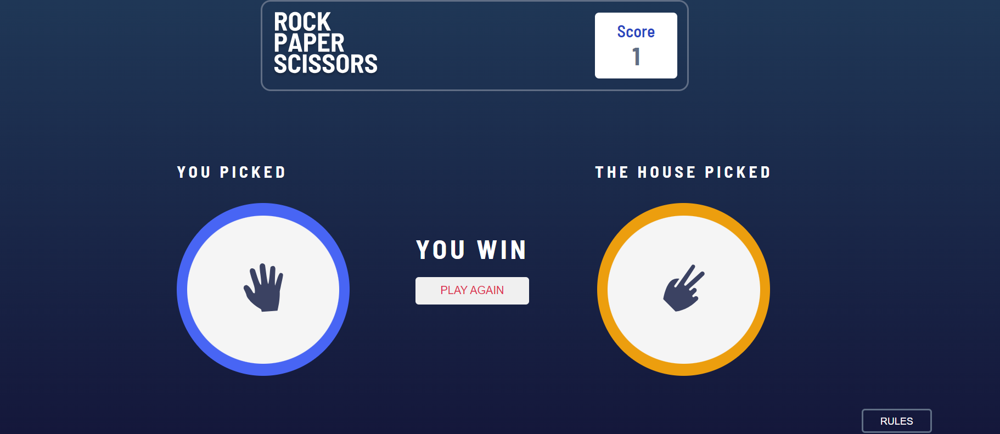
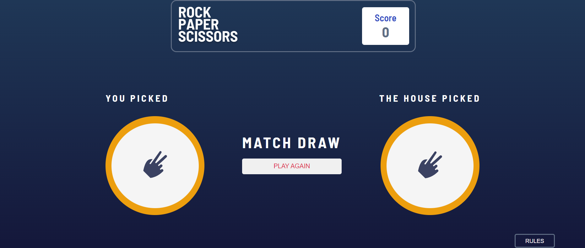

# rock-paper-scissors-game-javascript
# Frontend Implementation of Rock, Paper, Scissors Game using HTML, CSS, & JavaScript 

Welcome to the Rock, Paper, Scissors Game repository! This project offers a delightful rendition of the classic Rock, Paper, Scissors, thoughtfully crafted with HTML, CSS, and JavaScript to provide an engaging gaming experience.

## Overview

This project presents an interactive frontend layout for the timeless Rock, Paper, Scissors game. The design is intuitively created and seamlessly adapts to various screen sizes, ensuring an enjoyable gaming experience across desktops, tablets, and smartphones.  

## How to Play

To enjoy the Rock, Paper, Scissors game, follow these simple steps: 

1. Clone the Repository: Begin by cloning this repository to your local machine using the following command:

```bash
https://github.com/haseebtahir-dev/rock-paper-scissors-game-javascript.git

```
2. Open index.html: Navigate to the project directory and open the index.html file in your preferred web browser. You will be able to explore the complete frontend design.
   
## Contributions
Contributions are welcomed to enhance the game further. If you have any suggestions, bug fixes, or new features to introduce, feel free to create a pull request. Please ensure your contributions align with the project's goals and adhere to best practices. .

## Credits
This Rock, Paper, Scissors game draws inspiration from various online tutorials and resources on JavaScript game development.

## License
The "Rock, Paper, Scissors Game" repository is open-source and licensed under the GNU License. You are free to use, modify, and distribute the code according to the terms of the license






